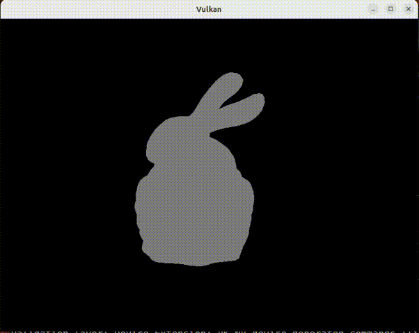
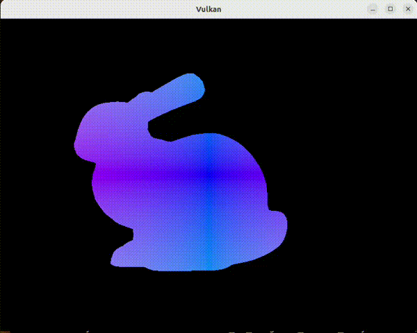
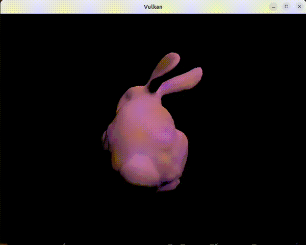

## Background

I wrote some vulkan code to load a model and render it using Phong Shading. It involved some vulkan code and shaders in glsl. However, lighting wouldn't work. I would get a blank screen when running the code.

Here is code for the two shaders

```
/////////// VERTEX SHADER ///////////////
#version 450

layout(binding = 0) uniform UniformBufferObject {
  mat4 model;
  mat4 view;
  mat4 proj;
} ubo;

layout(location = 0) in vec3 inPosition;
layout(location = 1) in vec3 inNormal;
layout(location = 2) in vec2 inTexCoord;

layout(location = 0) out vec3 fragNormal;
layout(location = 1) out vec3 fragPosition;
layout(location = 2) out vec2 fragTexCoord;

void main() {
  mat4 nmat = transpose(inverse(ubo.view * ubo.model));
  fragNormal = mat3(nmat) * inNormal;

  fragTexCoord = inTexCoord;
  fragPosition = vec3(ubo.view * ubo.model * vec4(inPosition, 1.0));
  
  gl_Position = ubo.proj * ubo.view * ubo.model * vec4(inPosition, 1.0);
}

/////////// FRAGMENT SHADER ///////////////
#version 450

layout(location = 0) in vec3 fragNormal;
layout(location = 1) in vec3 fragPosition;

layout(location = 0) out vec4 outColor;

void main() {
  // point light
  vec4 lightPos = vec4(0.0, 0.0, 0.0, 1.0);

  vec4 ambientColor = vec4(0.2, 0.2, 0.2, 1.0);
  vec4 diffuseColor = vec4(0.6, 0.2, 0.3, 1.0);
  vec4 specularColor = vec4(1.0, 1.0, 1.0, 1.0);

  outColor = vec4(0.0, 0.0, 0.0, 1.0);

  outColor += ambientColor;

  vec3 camera_space_normal = normalize(fragNormal);
  vec3 camera_space_lightDir = normalize(lightPos.xyz - fragPosition);

  float diffuseIntensity = max(dot(camera_space_normal, camera_space_lightDir), 0.0);
  outColor += diffuseColor * diffuseIntensity;

  outColor = clamp(outColor, 0, 1);
}
```



### Remove ambient lighting and check diffuse light

The result was that only ambient lighting was showing up. This is same as a constant color being added everywhere. Clearly the diffuse component wasnt being added. It may mean that the diffuse component is infact always zero. That can mean that diffuse component is infact always negative and it is getting clamped at `0.0` because of the `max` component. Let us investigate that by assigning the diffuse component at the component of light. Also, I will turn off ambient lighting. The resulting fragment shader would like the following

```
...
void main() {
  ...

  outColor = vec4(0.0, 0.0, 0.0, 1.0);

  ...

  float diffuseIntensity = dot(camera_space_normal, camera_space_lightDir);
  
  if (diffuseIntensity < 0) {
    outColor = vec4(-diffuseIntensity, -diffuseIntensity, -diffuseIntensity, 1.0);
  }
}
```

This resulted in nothing being rendered :(

### Check if the dot product is always zero

This resulted in nothing being visible which means `diffuseIntensity` is not negative either. It could mean that `diffuseIntensity` is always zero?!?!?? It could be that the dot product is always zero. This is possible if all normals are always perpendicular to the light dir. This is very very unlikely. The more likely thing happening here could be that either one or both of `camera_space_normal` or `camera_space_lightdir` are always zero.

#### Set outColor as the normal at that point

Let us check `camera_space_normal` first. We will set `outColor` to the absolute values of the normal.

```
// set outColor to the absolute values of normal to check if they are ever non-zero
outColor = vec4(abs(camera_space_normal), 1.0);
```

This resulted in the following resulted in a blank screen again meaning the normal is zero everywhere.

#### Set outColor as the lightDir at that point

Let us also check `camera_space_lightDir` by setting its absolute value as outColor. Both could be zero.

```
outColor = vec4(abs(camera_space_lightDir), 1.0);
```



Clearly, lightDir is not zero everywhere meaning lightDir could be correct.

We will have to further inspect why the normal is zero everywhere

### Inspecting the code where we create the normals

I implemented my own obj file reader. Here's the pseudo code describing the code

```
// read the file
std::ifstream modelFile(MODEL_PATH.c_str());

// iterate through every line
while (... every vertex line ...) {
  // read every vertex and store it
  // in a vector
  // also assign the normal for the vertex as zero
}

while (... every face ...) {
  // get the three vertices for the face
  // construct vectors corresponding to it edges
  // compute cross producct of the two edges

  // for each of the three vertices, increment the
  // vertex's normal with this cross product
}

for (every vertex) {
  // normalize the normal as the final normal
}
```

I added some `cout` statements to figure out what the normal value is for each vertex. I need to check if the normal values are zero? On running the code, I get the following result -

```
normal at vertex: vec3(-nan, -nan, -nan)
normalized normal: vec3(-nan, -nan, -nan)
normal at vertex: vec3(-nan, -nan, -nan)
normalized normal: vec3(-nan, -nan, -nan)
normal at vertex: vec3(-nan, -nan, -nan)
normalized normal: vec3(-nan, -nan, -nan)
normal at vertex: vec3(-nan, -nan, -nan)
normalized normal: vec3(-nan, -nan, -nan)
normal at vertex: vec3(-nan, -nan, -nan)
```

Clearly, the normal is not defined correctly. On going through the code once again, I see the problem.  I realized that the last `for loop` was infact wrapped inside the while loop immediately before it. I introduced this bug and figured I need to change the code. I took the for loop outside the while loop.

On running the code once again, I see the following as output

```
normalized normal: vec3(-0.261505, -0.941225, -0.213802)
normal at vertex: vec3(-0.629102, -3.133038, -4.387936)
normalized normal: vec3(-0.115894, -0.577175, -0.808355)
normal at vertex: vec3(4.633965, -1.864899, -0.759996)
normalized normal: vec3(0.917139, -0.369095, -0.150416)
normal at vertex: vec3(2.219076, -2.608599, -1.035577)
normalized normal: vec3(0.620214, -0.729083, -0.289435)
normal at vertex: vec3(-0.174536, -4.010030, -1.413008)
normalized normal: vec3(-0.041016, -0.942366, -0.332060)
normal at vertex: vec3(3.572911, -2.980712, -3.348010)
normalized normal: vec3(0.623292, -0.519983, -0.584058)
normal at vertex: vec3(-0.380020, -2.730968, -4.283769)
normalized normal: vec3(-0.074595, -0.536069, -0.840872)
normal at vertex: vec3(1.051317, -3.298064, -1.129301)
normalized normal: vec3(0.288734, -0.905781, -0.310151)
```
The normal is now not `Nan` and looks like the normals may be right. Let me assign its absolute value as the color in the fragment shader again to see what the result is.


The normals are now not zero and varying across the surface of the model.

### Setting the outColor as diffuse component again

Let us revert some of the changes by setting the outColor as the result of the dot product.

```
...
...
// setting outColor as the diffuse component
outColor = vec4(diffuseIntensity * vec3(diffuseColor), 1.0);
```

yields the following result



