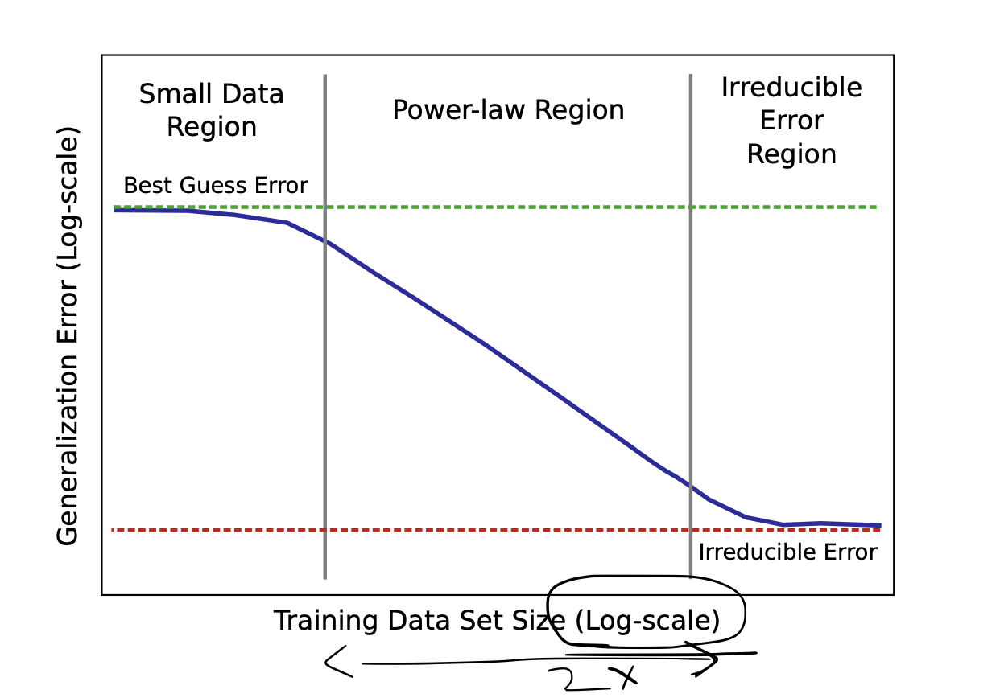
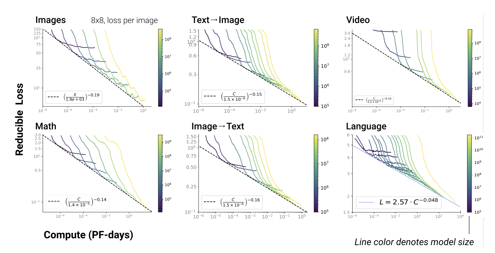
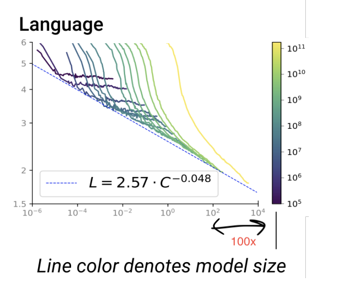
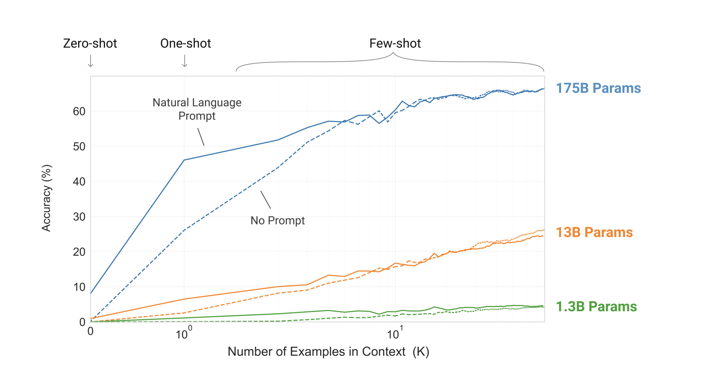

## Desired Audience

There is almost no math here in this post. I am linking the papers along the way and you are free to dive into those to see the math and theory in action. I am mostly interpreting a some charts in these papers. This exercise is to help me and hopefully the readers of this post appreciate the scale at which LLMs operate. We all know that LLMs need huge compute power and GPUs give a lot of love in that department. More GPUs you throw at the training problem, the better you are. However, costs of GPU pile up as you add more GPUs. Unfortunately, the "scale of economies" doesn't work here either. 10 GPUs will cost you about 10x a single GPU and not something like 8x or something. Unless you have a deal with cloud company in which case that might be possible but not possible in general case.

The papers I am going to discuss did a systematic study on how the compute power affects various things like time to train, reducible loss, etc. We will summarize some of those things with an GPUs, how many are needed, how much it would truly cost to train a good model, etc.

## A lot of data is required to train a good LLM

Over years, people have realized that making the network larger and larger has yielded better performance. [Joel, Sharan, et. al. in Deep Learning Scaling is Predictably Emperical](https://arxiv.org/abs/1712.00409) show through a variety of experiments in Machine Translation, Language Modeling, Image Processing and Speech Recognition that small data doesn't reduce generalization errors. We need a lot of data to beat that. With a lot of data, we can move cross the bridge of reducing generalization error and enter the land of irredicible errors which are... kind of irreducible and might need something else to fix. As shown in the below pic, the dataset increase is on a log scale. I am not sure if the plot is to scale but if we assume it is to scale, the x-axis difference between the two boundaries is almost double the first band. This means we need 10^2 more data to overcome that band and meaningfully reduce generalization error.

**Conclusion:** We need a lot of data to train a good LLM. If we have a large amount of data, the time to train increases or we have to throw more GPUs to the problem.

## Model Size Needs to be Large to Decrease Loss

In the paper [Scaling Laws for Autoregressive Generative Modeling, Tom, Jared, et. al.](https://arxiv.org/abs/2010.14701) show through various experiments that the error for the model reduces as the the number of parameters increase. They also show how the training time increases as these parameters increase. They show that their results are consistent in various domains like Images, Language, Speech, etc.

Again, the x-axis here is log scale. It shows the time needed to train the model in form on Peta FLOPs per day. Essentially, it is an indication of volume. Let us say you have enough GPUs to ensure 1 PetaFLOP of processing for one day. Let us look at the language chart more carefully -

The graph says that you need that infrastructure to continously run for `10^4` days to get a really good LLM model which has more than `10^11` parameters! Also, notice the increase in time from `10^2` days to `10^4` days as model size increases from `10^10` to `10^11` parameters. In simple words, if you increase the model size by 10x, the time to train it will increase from 100 days to 10000 days!

**Conclusion:** We need a lot of processing time for a lot of days. The only way to manage that is to have a lot of GPUs which can churn through all period and return a well rounded model.

## Model Size Should be Large for Few Shot Learning

In the paper [Language Models are Few Shot Learners - Brown, Mann, et. al.](https://arxiv.org/abs/2005.14165) show that as the number of parameters increase, the models ability to be a few shot learner becomes more and more attainable. In the image below, we see that accuracy jumps from under `10%` to more than `20%` as the parameter size becomes `10x` from `1.3B` to `13B` params. It jumps from 20% to over 60% as the model size increases by `15x`. So, overall, to move from under `10%` to over `60%`, we need a model that is `150x` larger!

**Conclusion:** We need a really large model to be able to do few shot learning. To basically see just a few examples and draw patterns out of it. This is what most people are impressed with ChatGPT and for that, it needs a lot of computation power. Why? Because very very large models need a lot of computation from the previous section.

## Conclusion

In this article we emperically looked at various graphs and charts to convince ourselves that a good LLM will need a lot of compute power and a lot of training data. The papers estabilish these ideas firmly with their math. Getting hands on a lot of GPUs for the compute power is a very costly undertaking. Getting good quality of labelled training data is also extremely extremely costly. We know that humans are more costly than GPUs! On top of it, acquiring this data is challenging given regulations, licenses, etc. A lot of money is needed to overcome those challenges.

All in all, training a good LLM is a super costly undertaking.
