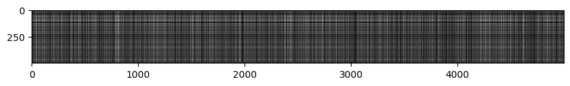

### Introduction

This post documents my thoughts and ideas while implementing the K-Nearest Neighbour model for image classification. This is part of stanford's CS231n course. While the course is about deep learning and computer vision, we start off my implementing simple baseline models to compare our performance and track its evolution.

### How does KNN Work?

At its heart, k-Nearest Neighbor model is a pretty intuitive model. For every example we are trying to classify, we look for its k nearest neighbors and retrieve their labels. These are all likely candidates for our test case and we take the majority way here. We check which label has come the highest number of times among the k neighbors and declare that be the label of the test example.

It assumes that similar examples are closer to each geometrically and their distances would be low. On the other hand, two examples with different labels would be further away with larger distance. This idea is a good one but breaks down when the example in question is close to the border of two different clusters. It could be equidistant to the different examples or in the worst case closer to the examples of the wrong class. We are hoping that by using looking at k closest neighbors, we will likely get the correct label.

### Runtime and Space Complexity

kNN model is not your classic ML model in the way that there is a model that is trained. We don't have a model artifact which is used for the final inference. All the training data is used for every inference. In that way, kNN model is very heavy on time and space usage. Inference time depends on the size of the training set. The space needed to the do inference also depends on the training set.

#### Time Complexity

Time Complexity for a single Inference is `O(num_train + num_train*log(k))`. We need `O(num_train)` time to compute the distances from the test example to all the training examples. And then, we need to go through all these distances and get the k closest distances. This would be `O(num_train * log(k))`. Overall, it would be `O(num_train * (1 + log(k)))` and since `log(k)` would grow very slowly as `k` would never go beyond `100`, we can write the whole thing as `O(num_train)`

For `num_test` test examples, the inference time would be `O(num_test * num_train)`.

#### Space Complexity

Again, we are storing the distances of each test example with all the training examples. Therefore we are looking at a matrix of distances where the size of the matrix is `O(num_test * num_train)`. Ofcourse there are other auxilliary items like label data, training data, etc. but those remain the same across various models and therefore we will assume them to be a constant, fixed cost and won't be considering their contribution.

### How to calculate Distances?

Before we begin, let us define some variables -

* `num_train` - number of training examples
* `num_test` - number of test examples
* `D` - number of features in each example

The size profiles of our data would look like the following -

* `X_train` - the matrix containing training examples would be `num_train x D` in size
* `X_test` - the matrix containing test examples would be `num_test x D` in size

In our case, since each example has D features, we are essentially looking at computing the distance between two D-dimensional vectors. We will be computing the euclidean distance between the two vectors and therefore the distance of any two vectors - `v1` and `v2` will be -

```
difference = v1 - v2
distance = np.sqrt(np.dot(difference, difference))
```

## Slow and Fast Code in Numpy

The assignment helped me understand the value of writing vectorized code in numpy. It's always possible to write naive, bruteforce python for loop code that will do what we want but numpy has a lot of optimized methods and we will have significant, significant speedups if we use those functions instead. Let us look at the distance computation code as an example to understand this fact.

The code to compute the distance for all the test examples with all the training examples would be -

```
distances = np.random.rand(num_test, num_train)
for i in range(num_test):
  for j in range(num_train):
    difference = X_test[i] - X_train[j]
    distances[i][j] = np.sqrt(np.sum(np.multiply(difference, difference), axis=1))
```

if we use `np.pow()` function, we can probably roll the two lines into one. Something like this -

```
distances = np.random.rand(num_test, num_train)
for i in range(num_test):
  for j in range(num_train):
    distances[i][j] = np.sqrt(np.sum(np.pow(X_test[i] - X_train[j], 2), axis=1))
```

Here we manually stepped through each possibility of `i` and `j` and set `distances[i][j]` appropriately. Please note that setting each element is completely independent of the other. They can, in essence be parallelized.

Numpy exploits the idea of CPU level SIMD instructions to do this.

### Computer Organization Detour

Imagine there is a freeway and the freeway has one lane only. All the cars will be one after the other and the line will be too long. However, if the freeway has multiple lanes, there will be multiple lines of cars and one lane will be independent of the other. We will be able to have more cars and these cars will be able to move faster. In a similar fashion, CPUs has multiple lanes for execution of the same instruction.

Let's say, you have a function that computes the log of a number. You can pass a single number and get the logarithm of that number. However, we can write code on CPU such that it can take multiple numbers and compute the logarithm of these numbers at the same time (separately ofcourse). This philosophy is called SIMD - Single Instruction Multiple Data. We have a single instruction - compute logarithm but we can operate on the multiple instances of data. The amount of multiple data that the processor can operate on gives us an idea of the how much parallelism it can expose.

GPUs typically have a lot more parallelism. Vertex Shading, Pixel shading are all examples of massive SIMD stages because of the sheer number of threads can run independently. CPUs on the other hand expose far lesser threads and therefore their SIMD is limited. By the way, this is not a bad thing! From Computer Organization, we know that CPU invests a large part of its chip real estate for Control Flow and therefore, we have less SIMD. GPUs on the other hand have much lower real estate for Control Flow and invest mostly in ALU and therefore are able to expose more parallelism. The downside is that these threads are more difficult to control and cooperate. Strategies to get them to cooperate are typically more nuanced.

In the case of numpy, authors spent time to write optimized methods so that we can pass in vectors/matrices and numpy, under the hood, will operate of multiple instances of data and give us a significant speed up.

### Using Principles of Broadcasting and Vectorized Code

Let us use the broadcast principles of numpy and go from two for loops to one for loop and finally zero for loops

#### One For Loop

```
distances = np.random.rand(num_test, num_train)
for i in range(num_test):
  ... ??? ...
```

We are iterating through the rows in test examples. Every test example should check itself against each example vector and then take the sum of distances. We are repeating the training vectors against each test example. Therefore, the code would become -

```
distances = np.random.rand(num_test, num_train)
for i in range(num_test):
  distances = np.sqrt(np.sum(np.pow(X_test[i] - X_train, 2), axis=1))
```

#### Zero For Loops

```
distances = ... ??? ...
```

This actually took some time for me to figure it out. I started by extending the line of thinking of two loops to one loops and to zero loops. We see that we are asking numpy to repeat the ith example for each training example. This is what broadcasting actually does internally.

Essentially, what we have done through **broadcasting** is -

```
X_test[i][0] X_test[i][1] ... X_test[i][D-1]               X_train[0][0] X_train[0][1] ... X_train[0][D-1]
...                                                        X_train[1][0] X_train[1][1] ... X_train[1][D-1]
...                                               .        ...
...                                                        ...
X_test[i][0] X_test[i][1] ... X_test[i][D-1]               X_train[n][0] X_train[n][1] ... X_train[n][D-1]
```

when I use `.` here, what I mean is element wise multiplication followed by addition of all the elements. so, the first row will become -

```
X_test[i][0]*X_train[0][0] + X_test[i][1]*X_train[0][1] +  ... + X_test[i][D-1]*X_train[0][D-1]
```

We could extend the above idea by stacking computations like this -

```
X_test[0][0] X_test[0][1] ... X_test[0][D-1]               X_train[0][0] X_train[0][1] ... X_train[0][D-1]
...                                                        ...
...                                                        ...
...                                                        ...
X_test[0][0] X_test[0][1] ... X_test[0][D-1]               X_train[n][0] X_train[n][1] ... X_train[n][D-1]

X_test[1][0] X_test[1][1] ... X_test[1][D-1]               X_train[0][0] X_train[0][1] ... X_train[0][D-1]
...                                                        ...
...                                                        ...
...                                                        ...
X_test[1][0] X_test[1][1] ... X_test[1][D-1]               X_train[n][0] X_train[n][1] ... X_train[n][D-1]

X_test[2][0] X_test[2][1] ... X_test[2][D-1]               X_train[0][0] X_train[0][1] ... X_train[0][D-1]
...                                                        ...
...                                               .        ...
...                                                        ...
X_test[2][0] X_test[2][1] ... X_test[2][D-1]               X_train[n][0] X_train[n][1] ... X_train[n][D-1]

...
...
...

X_test[m][0] X_test[m][1] ... X_test[m][D-1]               X_train[0][0] X_train[0][1] ... X_train[0][D-1]
...                                                        ...
...                                                        ...
...                                                        ...
X_test[m][0] X_test[m][1] ... X_test[m][D-1]               X_train[n][0] X_train[n][1] ... X_train[n][D-1]
```

In the above expression, we see that the first test example is repeated `num_train` times. Then the 2nd example is repeated `num_train` times. Finally, the last example is repeated `num_train` times.

On the other side, all the training examples came in at once. Then all of them come in again. And then again. This repeats `num_test` times.

We finally have `num_train * num_test` number of rows and `D` columns. For each of these rows, we take their element wise product and sum them giving us a `num_test*num_train X 1` matrix.

We reshape it into a `num_test * num_train` matrix and have the matrix that we needed in the first place. We haven't used any loops over here.

#### Describing the above in numpy

```
X_test_stack = np.repeat(X_test, num_train)
X_train_stack = np.tile(X_train, num_test)
...
```

We used `np.repeat` to repeat the rows in a non-interleaved manner. The first row is repeated n times. Then the second row is repeated n times, etc...
We used `np.tile` to repeat the rows in an interleaved manner. All the rows come in order. Then we repeat all the rows again. Then again, etc...

```
X_test_stack = np.repeat(X_test, num_train)
X_train_stack = np.tile(X_train, num_test)
distances = np.sqrt(np.sum(np.pow(X_test_stack - X_train_stack, 2), axis=1))
distances = distances.reshape((num_test, num_train))
```

The above method doesn't use for loops but relying on numpy using some for loop internally to create those two stack matrices. But there are bigger problems. Depending on the size of training and test examples, the matrix can grow very large. We will have two very large matrices that will have to be in memory for the computations to complete and this is exactly why it fails in the assignment. To be clear, the technique works on smaller matrices but runs out of memory for larger matrices. Therefore, we have to find another way to do this.

#### Square of a Difference

It was at this time that I saw a hint in the class notes. Expressing it as a broadcast sum of matrix multiplications and element wise products should do the trick. To really get this working, there were many mental hoops to jump and let me try to explain.

Our result is a `num_test X num_train` matrix. `distances[i][j]` represents the distance between `X_test[i]` and `X_train[j]`. More concretely `square_distances` is

```
(te[0] - tr[0])^2  (te[0] - tr[1])^2  ...  (te[0] - tr[n])^2
(te[1] - tr[0])^2  (te[1] - tr[1])^2  ...  (te[1] - tr[n])^2
...
...
...
(te[m] - tr[0])^2  (te[m] - tr[1])^2  ...  (te[m] - tr[n])^2
```

Let us open these expressions up ...

```
(te[0]^2 + tr[0]^2 - 2 * te[0] . tr[0]) ...  ...  ... (te[0]^2 + tr[n]^2 - 2 * te[0] . tr[n])
(te[1]^2 + tr[0]^2 - 2 * te[1] . tr[0]) ...  ...  ... (te[1]^2 + tr[n]^2 - 2 * te[1] . tr[n])
...
...
...
(te[m]^2 + tr[0]^2 - 2 * te[m] . tr[0]) ...  ...  ... (te[m]^2 + tr[n]^2 - 2 * te[m] . tr[n])
```

which can be further decomposed into -

```
       te[0].tr[0] te[0].tr[1] ... te[0].tr[n]        te[0]^2 te[0]^2 ... te[0]^2       tr[0]^2 tr[1]^2 ... tr[n]^2
-2*    ...                                       +    ...                          +    tr[0]^2 tr[1]^2 ... tr[n]^2
       te[m].tr[0] te[m].tr[1] ... te[m].tr[n]        te[m]^2 te[m]^2 ... te[m]^2       tr[0]^2 tr[1]^2 ... tr[n]^2
```

and at this stage, we start seeing a pattern -

```
-2* te.tr.T + te^2 + tr^2.T
```

and that's how we come up the numpy expression which is -

```
partneg2ab = -2 * np.matmul(X_test, X_train.T)
parta2 = np.sum(np.pow(X_test, 2), axis=1)
partb2 = np.sum(np.pow(X_train, 2), axis=1).T
...
```

The dimension of `partneg2ab` is `num_test X num_train`. The dimension of `parta2` is `num_test X 1` and the dimension of `partb2` is `1 * num_train`.

Adding partneg2ab and parta2 would mean that parta2 is broadcasted along the columns which is exactly what we want. Adding partb2 to that would mean that partb2 is broadcasted along the rows which is again what is want. Therefore the expression finally becomes

```
partneg2ab = -2 * np.matmul(X_test, X_train.T)
parta2 = np.sum(np.pow(X_test, 2), axis=1)
partb2 = np.sum(np.pow(X_train, 2), axis=1).T
distances = partneg2ab + parta2 + partb2
```

Actually, the above expression doesn't work. Because the the size of `parta2` is infact `(num_test, )` and `partb2` is `(num_train, )`. And these are not okay from the point of view of broadcasting. Broadcasting needs the column or row to be explicitly defined as `1`. Therefore we will have to reshape it before the sum. With that, the final code becomes the following -

```
partneg2ab = -2 * np.matmul(X_test, X_train.T)
parta2 = np.sum(np.pow(X_test, 2), axis=1).reshape((num_test, 1))
partb2 = np.sum(np.pow(X_train, 2), axis=1).reshape((num_train, 1)).T
distances = partneg2ab + parta2 + partb2
```

And the above expression finally works.

#### Did the optimizations actually work?

On timing the functions and printing out the time, we see the following results --

```
Two loop version took 13.152714 seconds
One loop version took 23.205184 seconds
No loop version took 0.397820 seconds
```

I am not sure why One loop code is slower than Two loop code. However, what is expected is that Zero Loop code will be much faster than either of the two. And it is. The vectorized code is close to 30-60x faster than the other two implementations!

We can already see the benefit of this. kNN algorithm's inference time scales with the number of training examples and the faster the distance computation, the better.

### Crossvalidations and Getting the Best Result

We do cross validations to determine the best `k`. Essentially, we define the number of folds. Let us define it as 5. This means that our training dataset will be divided into `5` parts. We choose `4` parts randomly and call it the training data. The 5th part is used as "testing data" to check how well we have done. We do this a number of times to choose different parts to make the training data. We also iterate through different values of `k`.

We essentially keep score of which `k` led to the best results over repeated, random sampling. Based on the data, we choose a `k` and decide that be the `k` from now on and use that for classifying the actual test data.

Here's where the zero loop code truly shines. We are running the distance computation code multiple times to determine the best `k`. Spending `20s` for each time with two loop code would mean our entire search could easily take `600s`. This is a lot of time. Using vectorized code, we are cutting that to `10s`.

After trying different `k` values in `[1, 5, 10, 50, 100]`, we land at an accuracy of `29%`.

### Thoughts on training and validation errors

The assignment asked two interesting questions. How will the training error of `1-NN` compare to training error of `5-NN`?

Training Error on training dataset is nothing but recall. And for `1-NN`, `recall` is 100% since it will point to the label of self. `5-NN` might actually introduce some errors because of majority voting. Therefore, training error for `1-NN` will be lower than `5-NN`.

On the other hand, validation error for `1-NN` will be higher than `5-NN`. `5-NN` has the advantage of generalization through majority voting and that will improve accuracy on the unseen data. Therefore validation error of `1-NN` will be higher than that of `5-NN`.

### Visualization of the Distances

On visualizing the distances matrix, we get the following image -



Clearly there are a few lines that are brighter than others. Brighter lines represent the images that are the most dissimilar (since their distance is the highest).

So, if we see a vertical bright line, we can say that the training image corresponding to that column is dissimilar to all the test cases.

A bright horizontal line means that the test example is dissimilar to most of the training examples.

A bright horizontal line with a dark break in between means that the test image was similar to the training images in that area but dissimilar to the rest.

-----------------

Thanks for reading this post!
